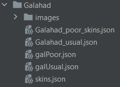

# spine-webpack-plugin
Webpack Plugin and Loader for resolving spine-animations.

### Usage

`npm i spine-webpack-plugin --save-dev`
```javascript
const {
  Plugin: SpineSpriteWebpackPlugin,
  loader: spineLoaderPath,
} = require('spine-webpack-plugin');

plugins.push(new SpineSpriteWebpackPlugin());
rules.push({
  type: 'javascript/auto',
  test: /\.json$/,
  include: /spine/,
  loader: spineLoaderPath,
});
```
A typical file with animations should look like:



### Settings of loader

You no need to configure your plugin.
You will need to set options for your loader only.
The best way to do that - using inline options.

Set scale option. This allows you to resolve skeleton, his assets,
scale them and final animation. 
Also you can set list of required animtaions.
```javascript
const config = require('@/assets/spine/Galahad/galUsual.json'
  + '?{"scale": 0.25, "animations": ["USUAL_GAL_ATTACK", "USUAL_GAL_RUN"] }');
```

Without scale option
you will resolve animations objects only.
```javascript
const config2 = require('@/assets/spine/Galahad/Galahad_usual_2.json'
  + '?{ "animations": ["USUAL_GAL_GET_LOOT"] }');
 ```

This "require" will resolve all animations from config:
```javascript
const config3 = require('@/assets/spine/Galahad/Galahad_usual_3.json'
  + '?{ "scale": 0.7 }');
 ```

### Output
You also can find sprite with map in your cache dir.
```javascript
config.skeleton.sprite.src // path to created sprite
config.skeleton.sprite.map // map of this sprite
 ```
