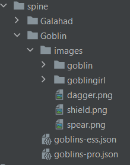

# spine-webpack-plugin
Webpack Plugin and Loader for resolving spine-animations,
scale their assets and creating sprites. Works with skins.

### Usage

`npm i spine-webpack-plugin --save-dev`
```javascript
const {
  Plugin: SpineSpriteWebpackPlugin,
  loader: spineLoaderPath,
} = require('spine-webpack-plugin');

plugins.push(new SpineSpriteWebpackPlugin());
rules.push({
  type: 'javascript/auto',
  test: /\.json$/,
  include: /spine/,
  loader: spineLoaderPath,
});
```
A typical structure of file with animations should
look like (separate assets in "images" subdirs):



### Settings of plugin
You can specify padding between images for your spritemap (2px as default).
```javascript
plugins.push(new SpineSpriteWebpackPlugin({ padding: 5 }));
```

### Settings of loader
You will need to set options for your loader only.
The best way to do that - using inline options.

Set scale option. This allows you to resolve skeleton, his assets,
scale them and final animation. 
Also, you can set list of required animations.
```javascript
const config = require('@/assets/spine/goblin/usual.json'
  + '?{"scale": 0.25, "animations": ["ATTACK", "RUN"] }');
```

Without scale option
you will resolve animations objects only.
```javascript
const config2 = require('@/assets/spine/goblin/champion.json'
  + '?{ "animations": ["JUMP"] }');
 ```

This "require" will resolve all animations from config:
```javascript
const config3 = require('@/assets/spine/goblin/evil.json'
  + '?{ "scale": 0.7 }');
 ```

Choose skins that you want to use ("default" skin always resolved,
if "scale" option passed). "Skins" option needs to avoid unused assets,
but you still can use all skins.
```javascript
const config4 = require('@/assets/spine/goblin/goblins-pro.json'
  + '?{ "scale": 0.5, "skins": ["goblingirl"] }');
 ```

### Output
You also can find sprite with map in your cache dir.
```javascript
config.skeleton.sprite.src // path to created sprite
config.skeleton.sprite.map // map of this sprite
 ```
